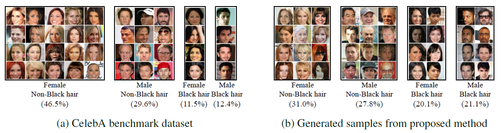
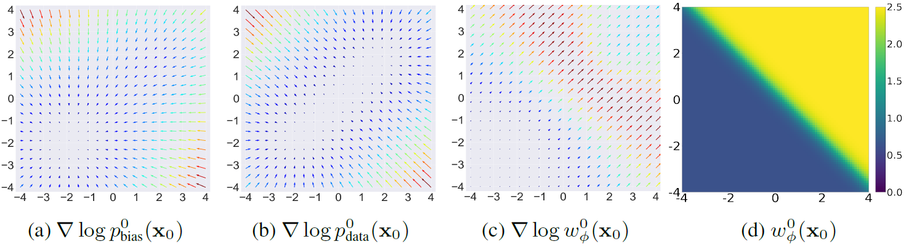

## TRAINING UNBIASED DIFFUSION MODELS FROM BIASED DATASET (TIW-DSM) (ICLR 2024) <br><sub>Official PyTorch implementation of the TIW-DSM </sub>


**[Yeongmin Kim](https://sites.google.com/view/yeongmin-space/%ED%99%88), [Byeonghu Na](https://sites.google.com/view/byeonghu-na), Minsang Park, [JoonHo Jang](https://sites.google.com/view/joonhojang), [Dongjun Kim](https://sites.google.com/view/dongjun-kim), [Wanmo Kang](https://sites.google.com/site/wanmokang), and [Il-Chul Moon](https://aai.kaist.ac.kr/bbs/board.php?bo_table=sub2_1&wr_id=3)**   

| [openreview](https://openreview.net/forum?id=39cPKijBed) | [arxiv](https://arxiv.org/abs/2403.01189) | [datasets](https://drive.google.com/drive/u/0/folders/1RakPtfp70E2BSgDM5xMBd2Om0N8ycrRK)  | [checkpoints](https://drive.google.com/drive/u/0/folders/1vYLH8UNlXWZarn0IOtiPuU8FvBFqJvTP) |

--------------------

## Overview


## Requirements
The requirements for this code are the same as those outlined for [EDM](https://github.com/NVlabs/edm).

## Datasets
  - Download from [datasets](https://drive.google.com/drive/u/0/folders/1RakPtfp70E2BSgDM5xMBd2Om0N8ycrRK) with similar directory structure.
## Training
- Download pre-trained feature extractor from [checkpoints](https://drive.google.com/drive/u/0/folders/1vYLH8UNlXWZarn0IOtiPuU8FvBFqJvTP).
  ### Time-dependent discriminator 
  - CIFAR10 LT / 5% setting
  ```
  python train_classifier.py
   ```
  - CIFAR10 LT / 10% setting
  ```
  python train_classifier.py --savedir=/checkpoints/discriminator/cifar10/unbias_1000/ --refdir=/datasets/cifar10/discriminator_training/unbias_1000/real_data.npz --real_mul=10
   ```
  - CelebA64 / 5% setting
  ```
  python train_classifier.py --feature_extractor=/checkpoints/discriminator/feature_extractor/64x64_classifier.pt --savedir=/checkpoints/discriminator/celeba64/unbias_8k/ --biasdir=/datasets/celeba64/discriminator_training/bias_162k/fake_data.npz --refdir=/datasets/celeba64/discriminator_training/unbias_8k/real_data.npz --img_resolution=64
   ```

  ### Diffusion model with TIW-DSM objective
  - CIFAR10 LT / 5% setting
  ```
  CUDA_VISIBLE_DEVICES=0,1,2,3  torchrun --standalone --nproc_per_node=4 train.py --arch=ddpmpp --outdir=out_dir --data=PATH/TIW-DSM/datasets/cifar10/score_training/500_10000/dataset.zip --batch=256 --tick=5 --duration=11
   ```
  - CIFAR10 LT / 10% setting
  ```
  CUDA_VISIBLE_DEVICES=0,1,2,3  torchrun --standalone --nproc_per_node=4 train.py --arch=ddpmpp --outdir=out_dir --data=PATH/TIW-DSM/datasets/cifar10/score_training/1000_10000/dataset.zip --batch=256 --tick=5 --duration=21
   ```
  - CelebA64 / 5% setting
   ```
  CUDA_VISIBLE_DEVICES=0,1,2,3  torchrun --standalone --nproc_per_node=4 train.py --arch=ddpmpp --batch=256 --cres=1,2,2,2 --lr=2e-4 --dropout=0.05 --augment=0.15 --outdir=outdir --data=PATH/TIW-DSM/datasets/celeba64/score_training/dataset.zip --cla_path=PATH/TIW-DSM/checkpoints/discriminator/feature_extractor/64x64_classifier.pt  --dis_path=PATH/TIW-DSM/checkpoints/discriminator/celeba64/unbias_8k/discriminator_9501.pt --tick=5
   ```

## Sampling
- CIFAR10
   ```
  torchrun --standalone --nproc_per_node=2 generate.py --outdir=out --seeds=0-49999 --batch=64 --network=TRAINED_PKL
   ```
- CelebA64
   ```
  torchrun --standalone --nproc_per_node=2 generate.py  --steps=40 --outdir=out --seeds=0-49999 --batch=64 --network=TRAINED_PKL
   ```
## Evaluation
  - CIFAR10
   ```
  python fid.py calc --ref=https://nvlabs-fi-cdn.nvidia.com/edm/fid-refs/cifar10-32x32.npz --num=50000 --images=YOUR_SAMPLE_PATH
   ```
  - CelebA64
   ```
  python fid.py calc --ref=/PATH/TIW-DSM/datasets/celeba/evaluation/FID_stat.npz --num=50000 --images=YOUR_SAMPLE_PATH
   ```

## Reference
If you find the code useful for your research, please consider citing
```bib
@inproceedings{
kim2024training,
title={Training Unbiased Diffusion Models From Biased Dataset},
author={Yeongmin Kim and Byeonghu Na and Minsang Park and JoonHo Jang and Dongjun Kim and Wanmo Kang and Il-chul Moon},
booktitle={The Twelfth International Conference on Learning Representations},
year={2024},
url={https://openreview.net/forum?id=39cPKijBed}
}
```
This work is heavily built upon the code from
 - *Tero Karras, Miika Aittala, Timo Aila, and Samuli Laine. Elucidating the design space of diffusion-based generative models. Advances in Neural Information Processing Systems, 35:26565–26577,2022.*
 - *Dongjun Kim\*, Yeongmin Kim\*, Se Jung Kwon, Wanmo Kang, and Il-Chul Moon. Refining generative process with discriminator guidance in score-based diffusion models. In Proceedings of the 40th International Conference on Machine Learning, volume 202 of Proceedings of Machine Learning Research, pp. 16567–16598. PMLR, 23–29 Jul 2023*


